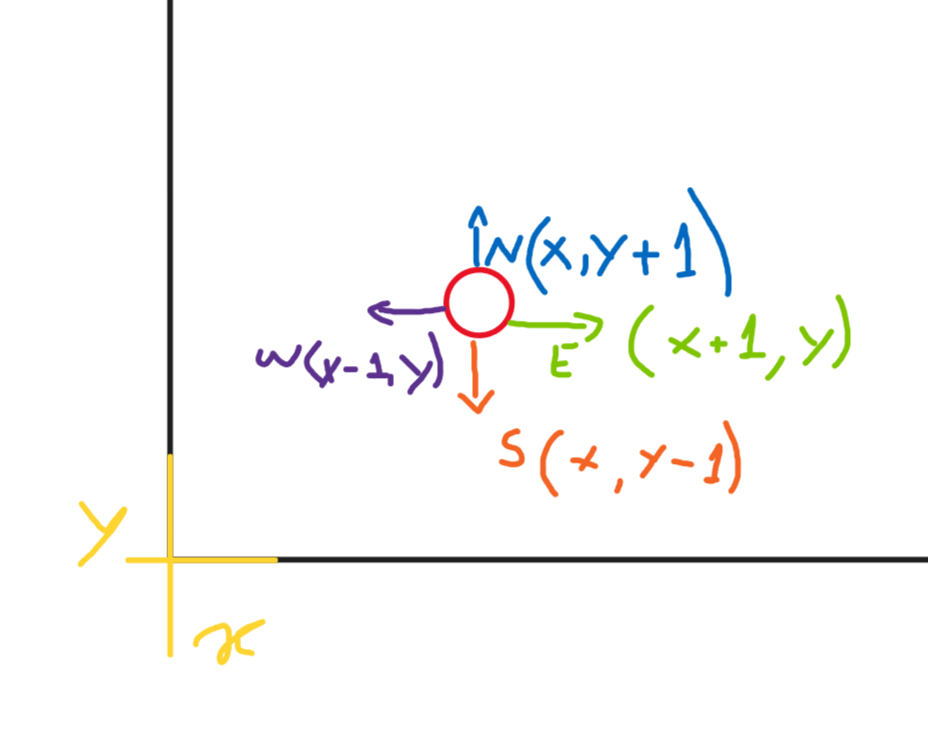
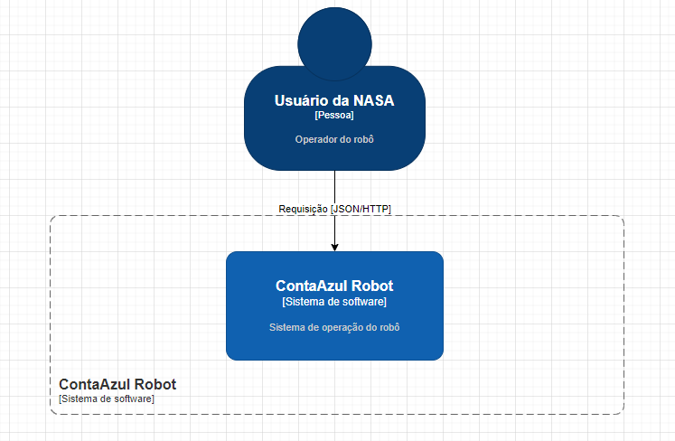
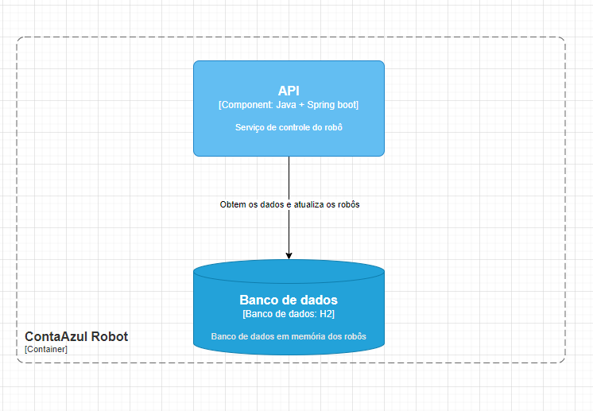
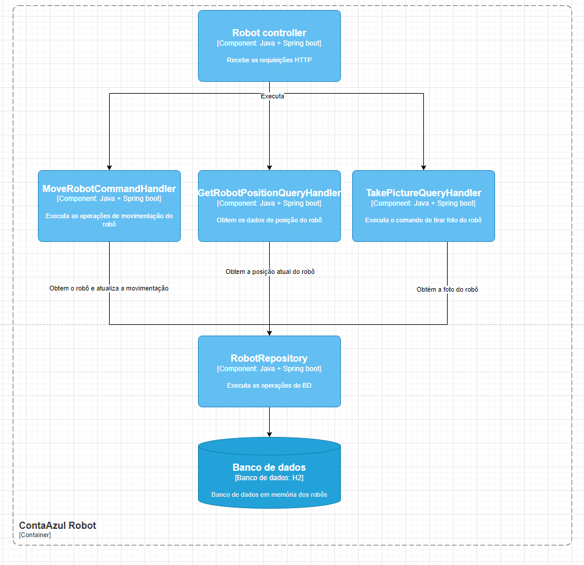

# Sobre

Sistema do desafio do processo para o cargo de Engenheiro de Software na Conta Azul. 

Tem como objetivo controlar robôs em Marte a partir de requisições HTTP.

O robô funciona em um plano horizontal, da seguinte maneira:



O banco de dados é incializado em memória (h2), onde são criados 3 robôs na base de dados no momento 
em que a aplicação sobe:

| id | x_position | y_position | orientation |
|----|------------|------------|-------------|
| 1  | 0          | 0          | N           |
| 2  | 3          | 4          | S           |
| 3  | 1          | 2          | W           |

# Requisitos

* Postman (opcional)
* GraalVM 17.0+

# Stack

O sistema foi feito com base no Java 17+ e framework Spring boot.

* Building
    * [Maven](https://maven.apache.org/guides/index.html): Sistema de build automatizado
* Testing
    * [JUnit 5](https://junit.org/junit5/docs/current/user-guide/): Framework de testes


# Uso

## Executando remotamente

O serviço foi hospedado num _cloud hosting_ chamado Render. A Url de acesso é:
https://conta-azul-challenge.onrender.com/api/v1/ na qual abrirá a documentação do _Swagger_ como página inicial.

Para executar os recursos do serviço no _cloud hosting_, basta alterar o Server para utilizar o Render (`https://conta-azul-challenge.onrender.com/api/v1`).

## Executando localmente

Para executar o projeto localmente, pode-se subi-lo em sua IDE favorita ou pelo comando:

```
$ ./mvnw && spring-boot:run
```

Ou pode-se executar via Docker.

Para buildar o projeto:

````
$ docker build -t conta-azul-challenge .      
````

Para executar a imagem gerada no Docker:

````
$ docker run -p 8080:8080 conta-azul-challenge
````

## Banco de dados
Para acessar o banco em memória, basta acessar a url `http://localhost:8080/api/v1/h2-console/` e os seguintes parâmetros:

```
Driver Classs: org.h2.Driver
JDBC URL: jdbc:h2:mem:testdb
User Name: robot
Password: robot
```


A aplicação possui um [Swagger](https://swagger.io/) no endereço `http://localhost:8080/api/v1/swagger/index.html`, 
onde existem os _endpoints_ e suas respectivas documentações. Além disso, dentro do projeto, na pasta `src.postman` 
existe uma _collection_ do postman também.

## Rodando os testes

Para rodar a suíte de testes, execute:

```
$ ./mvnw test
```

# _Troubleshooting_

* Caso ocorra erro de permissão com a execução de comandos `./mvnw`, dê a permissão de execução, com:

````
$ chmod +x mvnw
````

# Modelo C4

C1:



C2:



C3: 

